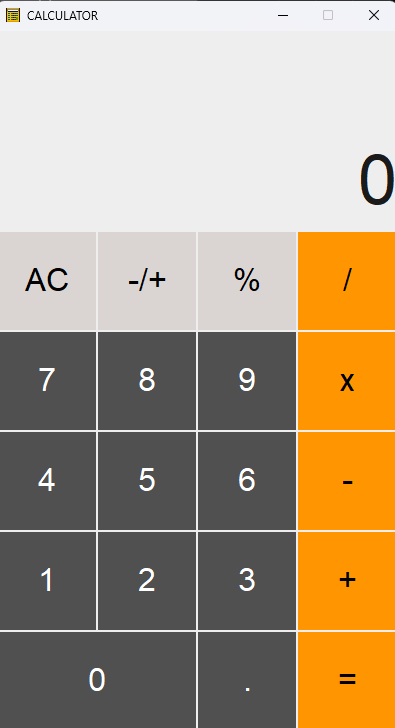
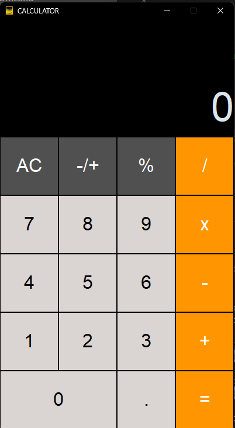

# Python iOS Calculator

This is a simple iOS-style calculator implemented in Python using the `customtkinter` library.

## Features

- iOS-inspired user interface.
- Basic arithmetic operations (addition, subtraction, multiplication, division).
- Percentage and invert functionality.
-  Light and Dark themes for improved user experience.

## Screenshots





## Installation

1. **Clone the Repository:**
   ```bash
   git clone https://github.com/akashpd390/python-ios-calculator.git
   cd python-ios-calculator`` 

2.  **Install Dependencies:** Make sure you have Python installed on your system. Install the required libraries using the following command:
    
    bashCopy code
    
    `pip install -r requirements.txt` 
    
3.  **Run the Calculator:**
        
    ```python calculator.py```

     OR

    ```python3 calculator.py```
    

## Usage

-   **Basic Operations:**
    
    -   Use the number buttons to input digits.
    -   Click on the operator buttons for addition, subtraction, multiplication, and division.
    -   Press '=' for the result.
-   **Additional Functions:**
    
    -   AC: Clears the display and resets the calculation.
    -   Invert: Inverts the sign of the current value.
    -   %: Converts the current value to a percentage.

## Contributing

If you'd like to contribute to the project, follow these steps:

1.  Fork the repository.
2.  Create a new branch: `git checkout -b feature/my-feature`.
3.  Commit your changes: `git commit -am 'Add new feature'`.
4.  Push to the branch: `git push origin feature/my-feature`.
5.  Submit a pull request.

## Acknowledgements

-   customtkinter: Customized Tkinter library for enhanced GUI.

## Disclaimer

This iOS calculator is a simple project for educational purposes. Feel free to use and modify the code according to your needs.

Happy calculating!


To report any bugs and feedback contact us
	email==> akashpd390@gmail.com
	
